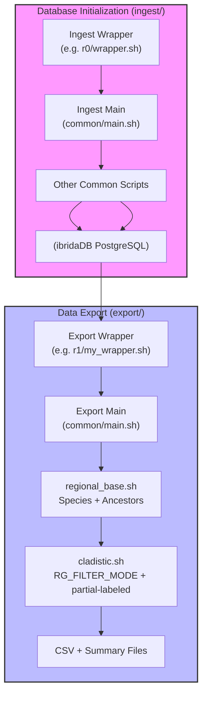

```mermaid
flowchart TB

    subgraph Ingest["Database Initialization (ingest/)"]
        i_wrap["Ingest Wrapper<br/>(e.g. r0/wrapper.sh)"]
        i_main["Ingest Main<br/>(common/main.sh)"]
        i_other["Other Common Scripts"]
        db["(ibridaDB PostgreSQL)"]
        i_wrap --> i_main
        i_main --> i_other
        i_other --> db
    end

    subgraph Export["Data Export (export/)"]
        e_wrap["Export Wrapper<br/>(e.g. r1/my_wrapper.sh)"]
        e_main["Export Main<br/>(common/main.sh)"]
        rbase["regional_base.sh<br/>Species + Ancestors"]
        clad["cladistic.sh<br/>RG_FILTER_MODE + partial-labeled"]
        csv_out["CSV + Summary Files"]
        e_wrap --> e_main
        e_main --> rbase
        rbase --> clad
        clad --> csv_out
    end

    i_other --> db
    db --> e_wrap

    style Ingest fill:#f9f,stroke:#333,stroke-width:2px
    style Export fill:#bbf,stroke:#333,stroke-width:2px

```