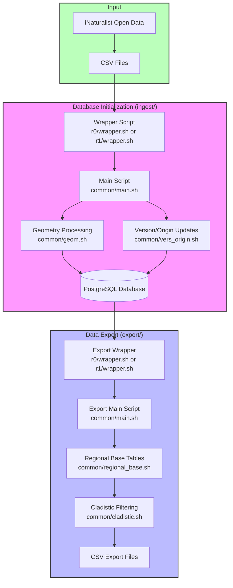

```mermaid
flowchart TB
    subgraph Input
        inat[iNaturalist Open Data]
        csv[CSV Files]
    end

    subgraph Ingest["Database Initialization (ingest/)"]
        wrapper[Wrapper Script\nr0/wrapper.sh or r1/wrapper.sh]
        main[Main Script\ncommon/main.sh]
        geom[Geometry Processing\ncommon/geom.sh]
        vers[Version/Origin Updates\ncommon/vers_origin.sh]
        db[(PostgreSQL Database)]
    end

    subgraph Export["Data Export (export/)"]
        exp_wrapper[Export Wrapper\nr0/wrapper.sh or r1/wrapper.sh]
        exp_main[Export Main Script\ncommon/main.sh]
        reg_base[Regional Base Tables\ncommon/regional_base.sh]
        clad[Cladistic Filtering\ncommon/cladistic.sh]
        csv_out[CSV Export Files]
    end

    inat --> csv
    csv --> wrapper
    wrapper --> main
    main --> geom
    main --> vers
    geom --> db
    vers --> db
    db --> exp_wrapper
    exp_wrapper --> exp_main
    exp_main --> reg_base
    reg_base --> clad
    clad --> csv_out

    style Ingest fill:#f9f,stroke:#333,stroke-width:2px
    style Export fill:#bbf,stroke:#333,stroke-width:2px
    style Input fill:#bfb,stroke:#333,stroke-width:2px
```