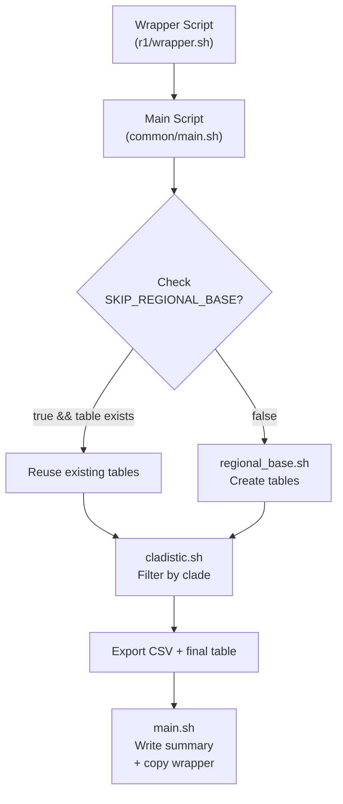

# ibridaDB Export Reference (v1)

This document describes how to configure and run an **ibridaDB** export job using our **v1** pipeline. The pipeline is driven by a set of **environment variables** that control which data are included, how they are filtered, and where the outputs are written. These variables are typically set in a **wrapper script** (e.g., `r1/wrapper.sh`).

Below is an overview of:

- [ibridaDB Export Reference (v1)](#ibridadb-export-reference-v1)
  - [NOTES/LIMITATIONS](#noteslimitations)
  - [Introduction \& Pipeline Overview](#introduction--pipeline-overview)
  - [Quick Start](#quick-start)
  - [Environment Variables](#environment-variables)
    - [Database Config](#database-config)
    - [Export Parameters](#export-parameters)
    - [Paths](#paths)
  - [Export Flow \& Scripts](#export-flow--scripts)
- [FUTURE](#future)

A **placeholder** for a mermaid diagram is provided below. You can generate or modify the diagram according to your team’s preferences and paste it in there.  

---
## NOTES/LIMITATIONS
- The upper boundary used for ancestor search, which is determine by the CLADE/METACLADE/MACROCLADE, is used for the regional-base tables ()"${REGION_TAG}_min${MIN_OBS}_all_sp_and_ancestors\"), not on one of the clade-export specific tables in cladistic.sh. So this is at odds with the previous design (before we added ancestor-aware logic), where previously the _all_sp table only varied by the REGION_TAG/MIN_OBS. This is probably OK, and might even be necessary for the purposes of determining the exact set of ancestral taxonIDs that need to be included in the base tables when looking to export more than just research-grade observations (i.e. observations with an uncontested species-level label) but it is a bit of a departure from the previous design. So we need to confirm what the set of taxa in the _all_sp_and_ancestors table depends upon (I think it is only the REGION_TAG/MIN_OBS/boundary ranks), and we can potentially mitigate by adjusting the generated base tables names to include the highest root rank (or highest root ranks, in the case of metaclades with multiple root ranks) used in the ancestor search; this will properly version the regional base tables and prevent reuse of base tables when the ancestor scopes differ.
  - So this means that the boundaries of the ancestor search for generating the regional _all_sp_and_ancestors is defined with respect to the configured clade/metaclade for a job, and so the regional base table might need to be recreated for successive job using clades/metaclades with different root ranks.
    - Really, the ancestor-aware logic should be implemented on the cladistic.sh tables.
    - The regional base table names do not fully capture the 'versining', so e.g. a NAfull_min50_all_sp_and_ancestors table generated from a PTA (metaclade) job would not be reusable for a successive job that used a MACROCLADES["arthropoda"]='("L60_taxonID" = 47120)' macroclade, since the PTA root ranks are lower than the L60 rank-- so that regional base table would be missing L50 ancestors. 
      - This would actually be OK in theory but it might break some downstream assumptions, so it would be better to recreate the regional base table for each successive job if that job uses a different root rank.
      - TODO: Confirm that it is only the root rank, not the root taxonID, that is used to define the ancestor search for the regional base tables.
        - If the regional base table _all_sp_and_ancestors only varies by the REGION_TAG/MIN_OBS/boundary ranks, then we could mitigate by adjusting the generated base tables names to include the highest root rank used in the ancestor search.
        - Otherwise, we would need to include the CLADE/METACLADE/MACROCLADE in the regional base table name.
  - regional base table is an increasingly inappropraite name for this table. It was fine when the tables always just included the species in the region that passed the MIN_OBS threshold/the corresponding observations, but the contents of the table are now dependent on the CLADE/METACLADE/MACROCLADE.
    - This issue was averted for INCLUDE_OUT_OF_REGION_OBS, because the regional base observations table always include all observations for the species in the region that passed the MIN_OBS threshold (and now for all their ancestors in the scope of the ancestor search, too).
      - And then if INCLUDE_OUT_OF_REGION_OBS=false, then we re-applied the bounding box for the final table.
    - There might be a similar mitigation approach we could take for ancestor search here. A much more inclusive set of observations for, i.e. _all_sp_and_ancestors would include all species in the region that passed the MIN_OBS threshold and all the ancestors of those species up to but not including L100 (state of matter), i.e. unrestricted ancestor search. _sp_and_ancestors_obs would include all observations where taxon_id=[<a taxonID from _all_sp_and_ancestors].
      - By default, only search for the major-rank ancestors, i.e. L20, L30, L40, L50, L57, L60, L70. So INCLUDE_MINOR_RANKS_IN_ANCESTORS=false. If INCLUDE_MINOR_RANKS_IN_ANCESTORS=true, then include minor ranks in the unbounded ancestor search, and adjust the table names (_all_sp_and_ancestors_incl_minor_ranks, _sp_and_ancestors_obs_incl_minor_ranks). Searching minor ranks can occur significant performance penalty as only major ranks are indexed, and we will not need to use this in the intermediate future.
      - Possibly do a second ancestor search with only the set of ancestors that are up to the boundary rank for that export? This would be used for the filtering for the final table for that export job.
      - But then, for the final table, we'd need to apply a filter to exclude the observations that fall outside of the scope of the job/clade-specific ancestor search. It gets kind of complicated to define this filter-- do we consider the base taxonID of the observation? Not necessarily, since sometimes we wipe labels of some ranks if the no. observations for that taxonID are too low in the final step (depending on MIN_OCCURRENCES_PER_RANK, which is an alternate floor for wiping labels for higher ranks if the no. occurences for those taxonIDs are too low, while still keeping the observations if they have passing labels for some ranks that are not wiped, e.g. an observation has a non-research grade species label, so we wipe L10_taxonID to null, and it has a L20_taxonID label that is very rare, so occurs less than MIN_OCCURRENCES_PER_RANK in the final table, but it has a usable L30_taxonID label and we want to downstream model to be able to learn that a sample like 'that' should be learned as being in that family (L30).
    - My current standing is that we should do the ancestor search with the constrained upper boundary, and accept that we will lose some reusability between regional base tables between exports that use different clades/metaclades (but maybe can reuse if the ranks of the clades stay constant between jobs, need to confirm).
      - This simplifies the logic in cladistic.sh and preserves the functionality of the existing filters in cladistic.sh.

## Introduction & Pipeline Overview

The **ibridaDB** export pipeline is designed to subset observations from a large PostgreSQL/PostGIS database based on:

- **Geographic region** (e.g., bounding box for North America).  
- **Minimum number of research-grade observations** required for each species (`MIN_OBS`).  
- **Taxonomic clade** (class, order, or custom “metaclade”).  
- **Export parameters** such as maximum number of photos per species, whether to include only the primary photo or all photos, etc.

The pipeline executes in the following broad stages:

1. **Wrapper Script** (e.g., `r1/wrapper.sh`) sets environment variables to configure the export.  
2. **Main Script** (`common/main.sh`) orchestrates creation of “regional base” tables if needed, then calls the **cladistic** filtering step.  
3. **Regional Base** (`common/regional_base.sh`): Creates two key tables:
   - `<REGION_TAG>_min${MIN_OBS}_all_taxa`, storing species that meet the threshold in the bounding box.  
   - `<REGION_TAG>_min${MIN_OBS}_all_taxa_obs`, storing all observations for those species, possibly including out-of-region if configured.  
4. **Cladistic** (`common/cladistic.sh`): Filters by the chosen clade/metaclade, creating a final table `<EXPORT_GROUP>_observations`. It then exports a CSV using partition-based random sampling.  
5. **Summary & Logging**: `main.sh` writes a single `*_export_summary.txt` that includes relevant environment variables, final observation counts, and other metrics. It also optionally copies the wrapper script for reproducibility.

---

## Quick Start

1. **Clone or navigate** to the `dbTools/export/v0` directory.  
2. **Create/modify** a wrapper script (e.g., `r1/wrapper.sh`) to set your parameters:
   - `REGION_TAG`, `MIN_OBS`, `MAX_RN`, `PRIMARY_ONLY`, etc.  
   - `CLADE` or `METACLADE` if focusing on a particular subset of taxa.  
   - Optionally `INCLUDE_OUT_OF_REGION_OBS` and `RG_FILTER_MODE`.  
3. **Run** the wrapper script. The pipeline will:
   - Create region-based tables (if not skipping).  
   - Join them to `expanded_taxa` for a final set of observations.  
   - Write a CSV with photo metadata.  
   - Dump a summary file describing the final dataset.

---

## Environment Variables

Below are the most commonly used variables. **All** variables are read in the wrapper, then passed to `main.sh` (and subsequently to `regional_base.sh` or `cladistic.sh`).

### Database Config

- **`DB_USER`**  
  - **Description**: PostgreSQL user for executing SQL.  
  - **Default**: `"postgres"`  

- **`VERSION_VALUE`**  
  - **Description**: Data version identifier (e.g. `"v0"`).  
  - **Usage**: Combined with `RELEASE_VALUE` to build `DB_NAME`. Also included in logs and table references.

- **`RELEASE_VALUE`**  
  - **Description**: Additional label for the data release (e.g., `"r1"`).  
  - **Usage**: Combined with `VERSION_VALUE` to create `DB_NAME`. Controls logic in some scripts (e.g., whether to include anomaly_score).

- **`ORIGIN_VALUE`**  
  - **Description**: Describes data provenance (e.g., `"iNat-Dec2024"`).  
  - **Usage**: Logged in summary contexts.

- **`DB_NAME`**  
  - **Description**: Full name of the database. Typically `"ibrida-${VERSION_VALUE}-${RELEASE_VALUE}"`.

---

### Export Parameters

- **`REGION_TAG`**  
  - **Description**: Specifies a broad region whose bounding box is defined in `regional_base.sh`.  
  - **Examples**: `"NAfull"`, `"EURfull"`.  
  - **Usage**: `regional_base.sh` calls `set_region_coordinates()` to set `$XMIN,$YMIN,$XMAX,$YMAX`.

- **`MIN_OBS`**  
  - **Description**: Minimum number of **research-grade** observations required for a species to be included in the region-based tables.  
  - **Usage**: In `regional_base.sh`, we gather species with at least `MIN_OBS` research-grade observations inside the bounding box.  
  - **Default**: `50`.

- **`MAX_RN`**  
  - **Description**: Maximum number of research-grade observations to be sampled per species in the final CSV.  
  - **Usage**: In `cladistic.sh`, we do a partition-based random sampling. Observations at species rank beyond `MAX_RN` are excluded in the final CSV.  
  - **Default**: `4000`.

- **`PRIMARY_ONLY`**  
  - **Description**: If `true`, only export the primary (position=0) photo for each observation; if `false`, include all photos.  
  - **Usage**: In `cladistic.sh`, the final `COPY` statement filters `p.position=0` if `PRIMARY_ONLY=true`.  

- **`CLADE`** / **`METACLADE`** / **`MACROCLADE`**  
  - **Description**: Used to define the clade or group of interest.  
  - **Usage**: In `clade_defns.sh`, we have integer-based conditions for major taxonomic ranks (e.g., `L50_taxonID=3` for birds). If `METACLADE` is set, it overrides `CLADE` or `MACROCLADE`.  
  - **Example**: `METACLADE="terrestrial_arthropods"` or `CLADE="amphibia"`.

- **`EXPORT_GROUP`**  
  - **Description**: The final label for the exported dataset; used to name `<EXPORT_GROUP>_observations` and the CSV.  
  - **Usage**: Also appended to summary logs, e.g., `amphibia_export_summary.txt`.

- **`PROCESS_OTHER`**  
  - **Description**: Generic boolean-like flag (default `false`).  
  - **Usage**: Not heavily used but can gate extra steps if desired.

- **`SKIP_REGIONAL_BASE`**  
  - **Description**: If `true`, skip creating region-based tables if they already exist and are non-empty.  
  - **Usage**: `main.sh` checks for `<REGION_TAG>_min${MIN_OBS}_all_taxa_obs`; if present and non-empty, it is reused.  
  - **Default**: `false`.

- **`INCLUDE_OUT_OF_REGION_OBS`**  
  - **Description**: If `true`, once a species is selected by `MIN_OBS` inside the bounding box, we include **all** observations of that species globally. If `false`, re-apply bounding box in final table.  
  - **Usage**: Set in `regional_base.sh`. Defaults to `true` in most wrappers to increase data coverage.

- **`RG_FILTER_MODE`**  
  - **Description**: Controls how research-grade vs. non-research observations are ultimately included in the final `<EXPORT_GROUP>_observations`.  
  - **Possible Values**:
    1. `ONLY_RESEARCH` — Only research-grade observations (`quality_grade='research'`).
    2. `ALL` — Include all observations, regardless of quality_grade.
    3. `ALL_EXCLUDE_SPECIES_NON_RESEARCH` — Include everything except non-research-grade at the species level (`L10_taxonID` non-null).
    4. `ONLY_NONRESEARCH` — Include only non-research-grade (`quality_grade!='research'`).
    5. `ONLY_NONRESEARCH_EXCLUDE_SPECIES` — Include only non-research-grade, but also exclude species-level assignments (`quality_grade!='research' AND L10_taxonID IS NULL`).
    6. `ONLY_NONRESEARCH_WIPE_SPECIES_LABEL` — Include only non-research-grade, but keep any records with a species-level guess. The `L10_taxonID` is forcibly set to `NULL` so the model does not see a species label.  
  - **Usage**: `cladistic.sh` uses a SQL CASE block to apply the correct filter logic. If the mode is unrecognized, it defaults to `ALL`. The final CSV export currently retains a separate step that filters photos by research-grade for sampling (e.g., `o.quality_grade='research'`), so you may wish to unify that logic if desired.

- **`INCLUDE_MINOR_RANKS_IN_ANCESTORS`**

- **`MIN_OCCURRENCES_PER_RANK`**
---

### Paths

- **`DB_CONTAINER`**  
  - **Description**: Docker container name running PostgreSQL (often `"ibridaDB"`).  
  - **Usage**: Scripts run `docker exec ${DB_CONTAINER} psql ...`.

- **`HOST_EXPORT_BASE_PATH`**  
  - **Description**: Host filesystem path to store exports.  
  - **Default**: `"/datasets/ibrida-data/exports"`.

- **`CONTAINER_EXPORT_BASE_PATH`**  
  - **Description**: Container path mapping to `HOST_EXPORT_BASE_PATH`.  
  - **Default**: `"/exports"`.

- **`EXPORT_SUBDIR`**  
  - **Description**: A subdirectory typically combining `VERSION_VALUE`, `RELEASE_VALUE`, and other parameters (e.g., `"v0/r1/primary_only_50min_4000max"`).  
  - **Usage**: `main.sh` assembles final output paths from `CONTAINER_EXPORT_BASE_PATH/$EXPORT_SUBDIR` and `HOST_EXPORT_BASE_PATH/$EXPORT_SUBDIR`.

- **`BASE_DIR`**  
  - **Description**: Path to the export scripts inside the container.  
  - **Usage**: Set in the wrapper to locate `common/functions.sh`, `common/regional_base.sh`, `common/cladistic.sh`, etc.

---

## Export Flow & Scripts

Below is the **script-by-script** overview:

1. **`wrapper.sh`**  
   - You define all environment variables needed for your particular export (see above).  
   - Sets `WRAPPER_PATH="$0"` so the pipeline can copy the wrapper into the output directory for reproducibility.  
   - Calls `main.sh`.

2. **`main.sh`**  
   - Validates environment variables.  
   - Creates the export directory (`EXPORT_SUBDIR`).  
   - **Optional**: If `SKIP_REGIONAL_BASE=true`, checks whether region-based tables already exist.  
   - Sources `regional_base.sh` if needed.  
   - Calls `cladistic.sh` to do the final clade-based filtering and CSV export.  
   - Gathers final stats (e.g., #observations, #taxa) from `<EXPORT_GROUP>_observations`.  
   - Writes a single summary file (`${EXPORT_GROUP}_export_summary.txt`).  
   - Optionally copies the wrapper script into the export folder.

3. **`regional_base.sh`**  
   - Sets bounding box coordinates for the region (`REGION_TAG`).  
   - Creates `<REGION_TAG>_min${MIN_OBS}_all_taxa`, selecting species with at least `MIN_OBS` research-grade obs.  
   - Creates `<REGION_TAG>_min${MIN_OBS}_all_taxa_obs`, either global or region-limited based on `INCLUDE_OUT_OF_REGION_OBS`.

4. **`cladistic.sh`**  
   - Loads `clade_defns.sh` to interpret `CLADE`, `METACLADE`, or `MACROCLADE`.  
   - Joins `<REGION_TAG>_min${MIN_OBS}_all_taxa_obs` to `expanded_taxa` and filters for active taxa matching the clade condition. Applies `RG_FILTER_MODE` to the final table. Produces `<EXPORT_GROUP>_observations`.  
   - Exports a CSV with photo metadata, applying `PRIMARY_ONLY` and random sampling of up to `MAX_RN` observations per species.

---

# FUTURE

- [x] Preferentially select in-region obs in the random sampling step (when we are applying the MAX_RN cap)
  - Implemented: preferential in-region sampling” for research-grade observations when applying the MAX_RN cap. In other words, for each species (L10_taxonID), all in-region observations are sampled first in random order; only if the total number of in-region observations is less than MAX_RN do out-of-region observations get pulled in (also in random order) to fill out the remainder of the cap.