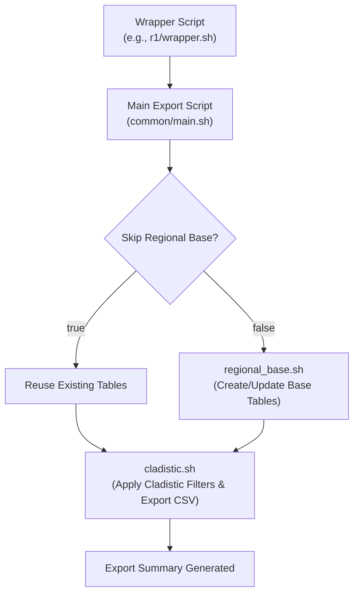

# ibridaDB

**ibridaDB** is a modular, reproducible database system designed to ingest, process, and export biodiversity observations from the [iNaturalist open data dumps](https://www.inaturalist.org/). It leverages PostgreSQL with PostGIS to efficiently store and query geospatial data and includes specialized pipelines for:

- **Data Ingestion:** Importing CSV dumps, calculating geospatial geometries, and updating metadata.
- **Elevation Integration:** Optionally enriching observations with elevation data derived from MERIT DEM tiles.
- **Data Export:** Filtering observations by region and taxonomic clade, performing advanced ancestor searches, and exporting curated CSV files for downstream model training.

This repository contains all the code, Docker configurations, and documentation required to build, run, and extend ibridaDB.

---

## Table of Contents

- [ibridaDB](#ibridadb)
  - [Table of Contents](#table-of-contents)
  - [Overview](#overview)
  - [Architecture](#architecture)
  - [Directory Structure](#directory-structure)
  - [Ingestion Pipeline](#ingestion-pipeline)
  - [Elevation Data Integration](#elevation-data-integration)
  - [Export Pipeline](#export-pipeline)
  - [Docker Build and Deployment](#docker-build-and-deployment)
  - [Configuration \& Environment Variables](#configuration--environment-variables)
  - [Adding a New Release](#adding-a-new-release)
  - [Release notes](#release-notes)
  - [License](#license)
  - [Final Notes](#final-notes)

---

## Overview

**ibridaDB** automates the process of:
- Reproducing a spatially enabled database from iNaturalist open data dumps.
- Optionally enriching the database with elevation data from MERIT DEM.
- Exporting curated subsets of observations for downstream training of specimen identification models.

The system is versioned both in terms of **database structure** (Version, e.g., "v0") and **data release** (Release, e.g., "r1"). These concepts allow you to reproduce different releases of the database while keeping the underlying schema consistent.

---

## Architecture

The overall workflow of ibridaDB is divided into three main stages:

1. **Ingestion:**  
   - **CSV Import:** Load observations, photos, taxa, and observers from CSV files.
   - **Geometry Calculation:** Compute geospatial geometries (using latitude/longitude) with PostGIS.
   - **Metadata Update:** Set version, release, and origin metadata on each table.
   - **Optional Elevation Processing:** If enabled, create a PostGIS raster table for DEM tiles, load MERIT DEM data, and update each observation with an elevation value.

2. **Export:**  
   - **Regional Base Tables:** Build tables that restrict species by geographic bounding boxes and minimum observation counts.
   - **Cladistic Filtering:** Further subset the observations based on taxonomic clade (or metaclade) conditions and other quality filters.
   - **Final CSV Export:** Generate CSV files with additional information (including photo metadata) and optionally include elevation data.

3. **Dockerized Deployment:**  
   - The system runs in a Docker container using a custom image that extends the official PostGIS image to include the `raster2pgsql` CLI tool (necessary for elevation data processing).

A high-level diagram of the export flow is shown below:



---

## Directory Structure

The repository is organized as follows:

```
ibridaDB/
├── dbTools/
│   ├── ingest/
│   │   └── v0/
│   │       ├── common/
│   │       │   ├── geom.sh              # Geometry calculations
│   │       │   ├── vers_origin.sh       # Version and origin metadata updates
│   │       │   └── main.sh              # Core ingestion logic
│   │       ├── r0/                      # Parameters for the initial release (r0)
│   │       │   └── wrapper.sh
│   │       ├── r1/                      # Parameters for the r1 release
│   │       │   └── wrapper.sh
│   │       └── utils/
│   │           ├── add_release.sh       # Legacy release update script
│   │           └── elevation/           # Elevation pipeline tools
│   │               ├── create_elevation_table.sql
│   │               ├── create_elevation_table.sh
│   │               ├── load_dem.sh
│   │               ├── main.sh          # Orchestrates elevation ingestion
│   │               ├── update_elevation.sh
│   │               └── wrapper.sh
│   └── export/
│       └── v0/
│           ├── common/
│           │   ├── functions.sh         # Shared export functions (including get_obs_columns())
│           │   ├── clade_defns.sh         # Clade condition definitions
│           │   ├── clade_helpers.sh       # Helpers for multi-root and clade processing
│           │   ├── regional_base.sh       # Regional base table generation
│           │   ├── cladistic.sh           # Cladistic filtering and final CSV export
│           │   └── main.sh                # Main export orchestration
│           └── r1/                        # Release-specific export wrappers
│               ├── wrapper_amphibia_all_exc_nonrg_sp.sh
│               ├── wrapper_amphibia_all_exc_nonrg_sp_oor_elev.sh
│               ├── wrapper_pta_all_exc_nonrg_sp.sh
│               └── wrapper_pta_all_exc_nonrg_sp_full_ancestor_search.sh
├── docker/
│   ├── Dockerfile                       # Custom Docker image build (with raster2pgsql)
│   └── (other Docker-related files, e.g., docker-compose.yml)
└── README.md                            # This high-level documentation
```

---

## Ingestion Pipeline

The ingestion pipeline is contained in `dbTools/ingest/v0/` and performs the following:

1. **Database Initialization:**  
   - Uses wrapper scripts (e.g., `r1/wrapper.sh`) to set parameters (DB name, source info, etc.).
   - The main script (`common/main.sh`) creates the database, imports CSV files, sets up tables and indexes, and computes geometries via `geom.sh`.

2. **Metadata Updates:**  
   - Updates the `origin`, `version`, and `release` columns in each table (via `vers_origin.sh`).

3. **Elevation Integration (Optional):**  
   - When `ENABLE_ELEVATION=true` is set in the wrapper, the elevation pipeline in `utils/elevation/` is invoked.
   - This pipeline creates an `elevation_raster` table, loads MERIT DEM tiles (using `raster2pgsql`), and updates `observations.elevation_meters`.

**Quick Start Example for Ingestion:**

```bash
chmod +x dbTools/ingest/v0/common/main.sh dbTools/ingest/v0/common/geom.sh dbTools/ingest/v0/common/vers_origin.sh dbTools/ingest/v0/r1/wrapper.sh
# To ingest a new release with elevation:
ENABLE_ELEVATION=true dbTools/ingest/v0/r1/wrapper.sh
```

---

## Elevation Data Integration

The elevation pipeline (located in `dbTools/ingest/v0/utils/elevation/`) provides the following functionality:

- **Create Elevation Table:**  
  - Runs `create_elevation_table.sh` to ensure the `elevation_raster` table exists.

- **Load DEM Data:**  
  - Uses `load_dem.sh` to extract and load MERIT DEM tiles into the database using `raster2pgsql`.  
  - **Note:** This requires the custom Docker image built with `raster2pgsql` (see Docker Build section below).

- **Update Elevation:**  
  - Runs `update_elevation.sh` to populate `observations.elevation_meters` using spatial joins with the raster data.
  
The pipeline is activated by setting `ENABLE_ELEVATION=true` in your ingest wrapper.

---

## Export Pipeline

The export pipeline (located in `dbTools/export/v0/`) allows you to generate specialized CSV exports from your ibridaDB database. Key features include:

1. **Regional Base Table Generation:**  
   - `regional_base.sh` creates base tables filtering species by a geographic bounding box (defined by `REGION_TAG`) and by a minimum number of research-grade observations (`MIN_OBS`).
   - It supports an option (`INCLUDE_OUT_OF_REGION_OBS`) to include all observations for selected species, along with computing an `in_region` boolean.

2. **Cladistic Filtering:**  
   - `cladistic.sh` further filters the regional observations by taxonomic clade (using `CLADE`, `METACLADE`, or `MACROCLADE` defined in `clade_defns.sh`).
   - The script also supports advanced options such as partial rank wiping (using `MIN_OCCURRENCES_PER_RANK` and `INCLUDE_MINOR_RANKS_IN_ANCESTORS`) and research-grade filtering (using `RG_FILTER_MODE`).

3. **CSV Export:**  
   - The final CSV export includes explicit columns from the observations and photo tables.
   - A new column `elevation_meters` is now included in the export if enabled by the environment variable `INCLUDE_ELEVATION_EXPORT` (set to true by default for new releases).
   - The CSV is produced via a partition-based random sampling method, ensuring that in-region research-grade observations are preferentially selected (controlled by `PRIMARY_ONLY` and `MAX_RN`).

**Quick Start Example for Export:**

```bash
chmod +x dbTools/export/v0/r1/wrapper_amphibia_all_exc_nonrg_sp_oor_elev.sh
# Run export (with elevation enabled) using the wrapper:
dbTools/export/v0/r1/wrapper_amphibia_all_exc_nonrg_sp_oor_elev.sh
```

---

## Docker Build and Deployment

**Custom Docker Image:**

The official PostGIS Docker image does not include the `raster2pgsql` CLI tool. To support elevation processing, we build a custom image that:

- Uses a multi-stage Docker build to install the PostGIS package (which includes `raster2pgsql`) in a builder stage.
- Copies the `raster2pgsql` binary into the final image.
- Is used in our Docker Compose configuration.

**Build and Push Instructions:**

```bash
cd docker
docker build -t frontierkodiak/ibridadb:latest . --no-cache
docker login
docker push frontierkodiak/ibridadb:latest
```

**Docker Compose:**

Our `docker-compose.yml` maps necessary volumes for:
- Exporting data (`/datasets/ibrida-data/exports`)
- Ingesting metadata (`/datasets/ibrida-data/intake`)
- Providing DEM data (`/datasets/dem`)

Refer to the `docker/stausee/docker-compose.yml` file for details.

---

## Configuration & Environment Variables

Both the ingest and export pipelines are configured via a rich set of environment variables. Key ones include:

- **Database Configuration:**  
  - `DB_USER`, `VERSION_VALUE`, `RELEASE_VALUE`, `ORIGIN_VALUE`, `DB_NAME`, `DB_CONTAINER`

- **Ingestion-Specific:**  
  - `SOURCE`, `METADATA_PATH`, `ENABLE_ELEVATION`, `DEM_DIR`, `EPSG`, `TILE_SIZE`

- **Export-Specific:**  
  - `REGION_TAG`, `MIN_OBS`, `MAX_RN`, `PRIMARY_ONLY`
  - Taxonomic filters: `CLADE`, `METACLADE`, `MACROCLADE`
  - Advanced export toggles:  
    - `INCLUDE_OUT_OF_REGION_OBS`  
    - `RG_FILTER_MODE`  
    - `MIN_OCCURRENCES_PER_RANK`  
    - `INCLUDE_MINOR_RANKS_IN_ANCESTORS`  
    - **`INCLUDE_ELEVATION_EXPORT`** – controls whether `elevation_meters` is included in the final export.

- **Paths:**  
  - `HOST_EXPORT_BASE_PATH`, `CONTAINER_EXPORT_BASE_PATH`, `EXPORT_SUBDIR`, `BASE_DIR`

For full details, please consult the export and ingest wrapper scripts in their respective directories.

---

## Adding a New Release

To add a new data release:
1. Create a new release directory (e.g., `dbTools/ingest/v0/r2/` and `dbTools/export/v0/r2/`).
2. Copy an existing wrapper script (from r1) into the new directory.
3. Update parameters such as:
   - `SOURCE` (e.g., change from "Dec2024" to "Feb2025")
   - `RELEASE_VALUE` (e.g., from "r1" to "r2")
   - Any new configuration (e.g., enable elevation by setting `ENABLE_ELEVATION=true` in ingest and `INCLUDE_ELEVATION_EXPORT=true` in export).
4. Run the ingestion/export processes using the new wrapper scripts.

## Release notes

Current versions:
- v0r0: June 2024 iNat data release
- v0r1: December 2024 iNat data release (adds anomaly_score column to observations table)
  - (in-place update) added elevation_meters column to observations tables  
  - (in-place update) Rebuilt expanded_taxa with ColDP integration (now includes common names at all taxonomic levels)
  - (in-place update) Added 4 new immediate ancestor columns to expanded_taxa: `immediateMajorAncestor_taxonID`, `immediateMajorAncestor_rankLevel`, `immediateAncestor_taxonID`, `immediateAncestor_rankLevel`

---

## License

[Insert License Information Here]

---

## Final Notes

- **Documentation Updates:**  
  This README provides a high-level overview. For detailed configuration of the ingest and export pipelines, please refer to:
  - `dbTools/ingest/v0/INGEST.md` (in progress)  
  - `dbTools/export/v0/export.md`

- **Contributions:**  
  Contributions and suggestions are welcome. Please submit pull requests or open issues if you encounter problems or have ideas for enhancements.

---

Happy Ingesting and Exporting!