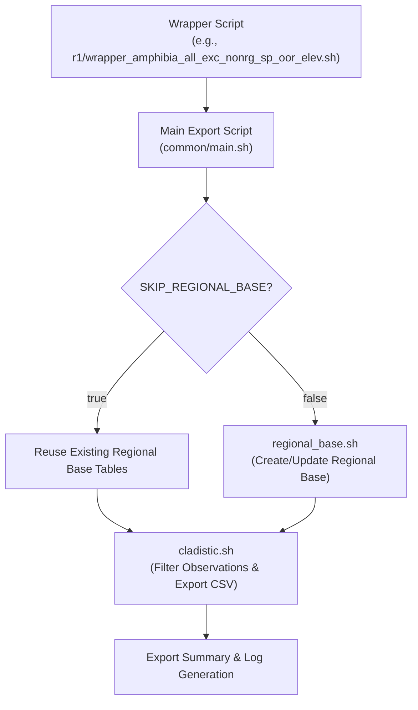

# ibridaDB Export Reference (v1)

This document describes how to configure and run an **ibridaDB** export job using our current export pipeline. The export process is driven by a set of **environment variables** that control which observations are included, how they are filtered, and where the outputs are written. These variables are typically set in a release‐specific wrapper script (e.g., `r1/wrapper_amphibia_all_exc_nonrg_sp_oor_elev.sh`).

> **Note:** This document has been updated to include new functionality such as ancestor‐based filtering, partial rank wiping, the `in_region` flag with out‐of‐region observation handling, and an optional inclusion of elevation data (via the `elevation_meters` column). See also the [Ingest Documentation](../ingest/INGEST.md) for details on how elevation data is integrated into the database.

---

## Table of Contents

- [ibridaDB Export Reference (v1)](#ibridadb-export-reference-v1)
  - [Table of Contents](#table-of-contents)
  - [Introduction \& Pipeline Overview](#introduction--pipeline-overview)
  - [Quick Start](#quick-start)
  - [Environment Variables](#environment-variables)
    - [Database Configuration](#database-configuration)
    - [Export Parameters](#export-parameters)
    - [Additional Flags and Advanced Settings](#additional-flags-and-advanced-settings)
    - [Paths](#paths)
  - [Export Flow \& Scripts](#export-flow--scripts)
  - [Output Files](#output-files)
  - [Future Work and Notes](#future-work-and-notes)

---

## Introduction & Pipeline Overview

The **ibridaDB Export Pipeline** extracts curated subsets of observations from a spatially enabled PostgreSQL/PostGIS database. It is designed to support advanced filtering based on:

- **Geographic Region:** Defined by a bounding box corresponding to a region tag (e.g., `"NAfull"`).
- **Species Observations:** A minimum number of research-grade observations per species (`MIN_OBS`) is required to be included.
- **Taxonomic Clade:** Filtering by a clade, metaclade, or macroclade is performed based on definitions in `clade_defns.sh`.
- **Quality & Ancestor Filtering:** The pipeline supports research-grade filtering (`RG_FILTER_MODE`), optional partial-rank wiping (using `MIN_OCCURRENCES_PER_RANK` and `INCLUDE_MINOR_RANKS_IN_ANCESTORS`), and computes an `in_region` boolean for each observation.
- **Elevation Data (Optional):** When enabled (via `INCLUDE_ELEVATION_EXPORT`), the final exported CSV will include an `elevation_meters` column immediately after `longitude`.

The export process follows these broad stages:

1. **Wrapper Script:** Sets all required environment variables.
2. **Main Export Script (`common/main.sh`):**
   - Validates variables and creates the export directory.
   - Ensures necessary PostgreSQL extensions and roles exist.
   - Calls **regional_base.sh** to generate region-based tables.
   - Invokes **cladistic.sh** to filter by clade and produce the final export table.
   - Generates a summary file with environment details and final statistics.
3. **Regional Base Generation (`common/regional_base.sh`):**
   - Sets the region’s bounding box.
   - Creates tables that capture species meeting the `MIN_OBS` threshold and computes an `in_region` flag.
   - Builds ancestor tables based on clade definitions.
4. **Cladistic Filtering & CSV Export (`common/cladistic.sh`):**
   - Joins the regional base observations to taxonomic data from `expanded_taxa`.
   - Applies research-grade filters, partial-rank wiping, and random sampling (using `MAX_RN`) per species.
   - Exports a final CSV that explicitly lists observation and photo columns (including `elevation_meters` if enabled).

A high-level diagram of the export flow is shown below:



---

## Quick Start

1. **Clone or navigate** to the `dbTools/export/v0` directory.
2. **Configure a wrapper script** (e.g., `r1/wrapper_amphibia_all_exc_nonrg_sp_oor_elev.sh`) to set your export parameters. For example:
   - Set region-specific parameters: `REGION_TAG`, `MIN_OBS`, `MAX_RN`, and `PRIMARY_ONLY`.
   - Specify the clade filter: `CLADE` or `METACLADE`.
   - Enable out-of-region observation handling: `INCLUDE_OUT_OF_REGION_OBS`.
   - Optionally, enable elevation export: `INCLUDE_ELEVATION_EXPORT=true` (if your database includes elevation data).
3. **Run the wrapper script** to initiate the export process:
   ```bash
   ./r1/wrapper_amphibia_all_exc_nonrg_sp_oor_elev.sh
   ```
4. **Review the output**:
   - A CSV file named `<EXPORT_GROUP>_photos.csv` will be saved to the export directory.
   - A summary file (`<EXPORT_GROUP>_export_summary.txt`) will be generated containing export parameters, statistics, and timing information.

---

## Environment Variables

The export pipeline is configured via several environment variables, which are typically set in your wrapper script.

### Database Configuration

- **`DB_USER`**  
  *Description:* PostgreSQL user (e.g., `"postgres"`).

- **`VERSION_VALUE`**  
  *Description:* Database version identifier (e.g., `"v0"`).

- **`RELEASE_VALUE`**  
  *Description:* Data release identifier (e.g., `"r1"`).  
  *Note:* For older releases (e.g., `"r0"`), certain features (such as `anomaly_score` and `elevation_meters`) may be absent.

- **`ORIGIN_VALUE`**  
  *Description:* Data provenance (e.g., `"iNat-Dec2024"`).

- **`DB_NAME`**  
  *Description:* Name of the database (e.g., `"ibrida-v0-r1"`).

- **`DB_CONTAINER`**  
  *Description:* Name of the Docker container running PostgreSQL (e.g., `"ibridaDB"`).

### Export Parameters

- **`REGION_TAG`**  
  *Description:* A key that defines the region’s bounding box (e.g., `"NAfull"`).  
  *Usage:* Used in `regional_base.sh` to set geographic coordinates.

- **`MIN_OBS`**  
  *Description:* Minimum number of research-grade observations required per species for inclusion.  
  *Default:* `50`.

- **`MAX_RN`**  
  *Description:* Maximum number of research-grade observations to sample per species in the final CSV.  
  *Default:* `2500` (or your desired value).

- **`PRIMARY_ONLY`**  
  *Description:* If `true`, only the primary photo (position=0) is included; if `false`, all photos are exported.

- **`CLADE` / `METACLADE` / `MACROCLADE`**  
  *Description:* Defines the taxonomic filter. For example, `CLADE="amphibia"` or `METACLADE="pta"` (primary terrestrial arthropods).

- **`EXPORT_GROUP`**  
  *Description:* A label for the final export; used to name the final observations table and CSV file (e.g., `"amphibia_all_exc_nonrg_sp_oor_elev"`).

### Additional Flags and Advanced Settings

- **`PROCESS_OTHER`**  
  *Description:* A generic flag for additional processing (default: `false`).

- **`SKIP_REGIONAL_BASE`**  
  *Description:* If `true`, the export pipeline will reuse existing regional base tables rather than recreating them.

- **`INCLUDE_OUT_OF_REGION_OBS`**  
  *Description:* If `true`, once a species is selected by `MIN_OBS`, all observations for that species (globally) are included; otherwise, only those within the bounding box are used.  
  *Note:* An `in_region` boolean is computed for each observation.

- **`RG_FILTER_MODE`**  
  *Description:* Controls how research-grade versus non-research observations are filtered.  
  *Possible values:* `ONLY_RESEARCH`, `ALL`, `ALL_EXCLUDE_SPECIES_NON_RESEARCH`, `ONLY_NONRESEARCH`, etc.

- **`MIN_OCCURRENCES_PER_RANK`**  
  *Description:* Minimum occurrences required per rank (e.g., L20, L30, L40) before that rank is retained.  
  *Usage:* Used to optionally wipe out low-occurrence partial rank labels.

- **`INCLUDE_MINOR_RANKS_IN_ANCESTORS`**  
  *Description:* If `true`, includes minor ranks in the ancestor search; otherwise, only major ranks are considered.

- **`INCLUDE_ELEVATION_EXPORT`**  
  *Description:* If `true` (the default for new releases), the final export will include the `elevation_meters` column (placed immediately after `longitude`).  
  *Note:* If the underlying database is older (e.g., release `"r0"`), set this to `false`.

### Paths

- **`HOST_EXPORT_BASE_PATH`**  
  *Description:* Host filesystem path where export files will be written (e.g., `"/datasets/ibrida-data/exports"`).

- **`CONTAINER_EXPORT_BASE_PATH`**  
  *Description:* Container path corresponding to `HOST_EXPORT_BASE_PATH` (e.g., `"/exports"`).

- **`EXPORT_SUBDIR`**  
  *Description:* A subdirectory constructed from variables (e.g., `"v0/r1/primary_only_50min_2500max"`).

- **`BASE_DIR`**  
  *Description:* Root directory of the export tools (e.g., `/home/caleb/repo/ibridaDB/dbTools/export/v0`).

---

## Export Flow & Scripts

The export process consists of several key steps:

1. **Wrapper Script:**  
   - A release-specific wrapper (e.g., `r1/wrapper_amphibia_all_exc_nonrg_sp_oor_elev.sh`) sets all necessary environment variables (including the new `INCLUDE_ELEVATION_EXPORT` toggle) and then calls the main export script.

2. **Main Export Script (`common/main.sh`):**  
   - Validates required variables and creates the export directory.
   - Installs necessary PostgreSQL extensions (such as `dblink`) and creates roles if needed.
   - Invokes **regional_base.sh** to generate region-specific base tables.
   - Calls **cladistic.sh** to join base tables with the taxonomic hierarchy (from `expanded_taxa`), apply quality and clade filters, and build the final export table.
   - Generates a summary file that documents the export parameters, final observation counts, and timing information.
   - Optionally copies the wrapper script into the output directory for reproducibility.

3. **Regional Base Generation (`common/regional_base.sh`):**  
   - Determines the geographic bounding box using `REGION_TAG` (from `region_defns.sh`).
   - Creates a species table (`<REGION_TAG>_min${MIN_OBS}_all_sp`) of species meeting the minimum observation threshold.
   - Builds an ancestor table (`<REGION_TAG>_min${MIN_OBS}_all_sp_and_ancestors_<cladeID>_<mode>`) by unrolling taxon ancestry for the selected species.
   - Generates a second table (`<REGION_TAG>_min${MIN_OBS}_sp_and_ancestors_obs_<cladeID>_<mode>`) that contains all observations for the selected species along with an `in_region` boolean flag.
   - The `INCLUDE_OUT_OF_REGION_OBS` flag governs whether the observation table is filtered by the bounding box or not.

4. **Cladistic Filtering & CSV Export (`common/cladistic.sh`):**  
   - Joins the observation table with `expanded_taxa` using clade conditions defined in `clade_defns.sh` (and processed by `clade_helpers.sh`).
   - Applies research-grade filtering based on `RG_FILTER_MODE` and uses a partition-based random sampling (controlled by `MAX_RN` and `PRIMARY_ONLY`).
   - Explicitly enumerates columns in the final export, including `elevation_meters` (if `INCLUDE_ELEVATION_EXPORT=true`), ensuring that the column appears immediately after `longitude`.
   - Exports the final dataset as a CSV file with a header and tab-delimited fields.
   - Debug SQL is executed to confirm the final column list used.

---

## Output Files

After a successful export, you will find:

- A CSV file named `<EXPORT_GROUP>_photos.csv` in the export subdirectory (e.g., `/exports/v0/r1/primary_only_50min_2500max`).
- A summary file named `<EXPORT_GROUP>_export_summary.txt` that documents:
  - The values of key environment variables.
  - Final observation, taxa, and observer counts.
  - Timing information for each stage of the export process.
- Optionally, a copy of the export wrapper script (if `WRAPPER_PATH` is set).

---

## Future Work and Notes

- **Enhanced Documentation:**  
  Future revisions will further detail the logic of ancestor searches and the random sampling strategy used for research-grade observations.
  
- **Additional Filtering Options:**  
  We plan to refine the `RG_FILTER_MODE` and allow further customizations (e.g., combining multiple quality filters).

- **Schema Updates:**  
  As new releases are introduced (e.g., additional columns beyond `anomaly_score` or `elevation_meters`), the export documentation will be updated to reflect the schema changes.

- **User Feedback:**  
  Contributions, bug reports, and suggestions for improvements are welcome.

---

Happy Exporting!